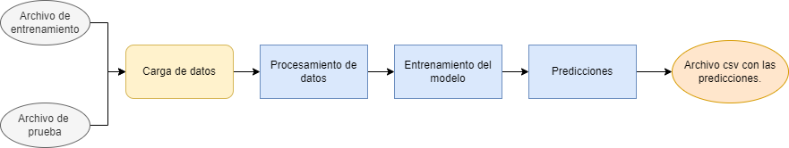

<h1 align="center"> Datathon :rocket: </h1>

> Repositorio para el datathon del bootcamp Soy Henry.  

[](https://www.gnu.org/licenses/gpl-3.0)

# **Tabla de Contenidos:**
- [**Tabla de Contenidos:**](#tabla-de-contenidos)
- [El datathon <a name="datathon"></a>](#el-datathon-)
- [Sobre el repositorio <a name="about_repo"></a>](#sobre-el-repositorio-)
- [Notebook <a name="notebook"></a>](#notebook-)
- [Pipeline <a name="pipeline"></a>](#pipeline-)
  - [Instrucciones de uso](#instrucciones-de-uso)


# El datathon <a name="datathon"></a>
El datathon es parte de la etapa de proyectos individuales del bootcamp Soy Henry. En este caso, se trató un problema de clasificación relacionado al mercado inmobiliario. El objetivo fue desarrollar un modelo de aprendizaje automático capaz de clasificar si una propiedad era barata o cara, tomando como frontera de división entre estas dos categorías la media de precios.

Para el datathon nos proporcionaron los datos que se encuentran disponibles en el archivo zip en la carpeta datasets: un conjunto de training, con los precios de las propiedades y un conjunto de testing sin los precios de las propiedades, para realizar las predicciones.

# Sobre el repositorio <a name="about_repo"></a>
En el repositorio se encuentra el notebook `modelos.ipynb`, donde se realizó el EDA, se entrenaron modelos para medir su rendimiento y se obtuvieron las predicciones.

En la carpeta *datasets* se encuentra el zip con los datos. Este debe ser descomprimido en la misma carpeta para que el notebook corra.

# Notebook <a name="notebook"></a>
El notebook esta organizado de la siguiente manera:
- **El EDA**: En esta parte encontramos la limpieza, calculos y visualización de variables. Las transformaciones principales que contribuyeron a los datos utilizados en la parte de entrenamiento se encuentran en funciones.
- **Prueba de modelos**: por ahora se probaron 3 modelos distintos con distintas combinaciones de los datos obtenidos del EDA.
- **Predicción**: Se escogió el modelo con mejor resultado para hacer las predicciones. En esta parte se hicieron las transformaciones pertinentes al set de prueba y se guardan las predicciones como un csv.

# Pipeline <a name="pipeline"></a>
El pipeline es esencialmente lo mismo que se encuentra en el notebook pero con los pasos descritos en funciones y solo se encuentran los procesos del mejor modelo luego de varias pruebas en el notebook. 

El pipeline funciona de la siguiente forma:
**Input**: archivos de entrenamiento y prueba proporcionados para el datathon.

**Pasos**
- Carga de archivo de entrenamiento y de prueba
- Procesamiento de archivos de entrenamiento y de prueba: esto incluye rellenar los valores faltantes en latitud y longitud, rellenar los valores faltantes en la columna `bathrooms`, creación de variables dummies, entre otros.
- Entrenamiento de un random forest.
- Predicción.
 
**Output**: archivo csv con las predicciones para el conjunto de prueba.

Este proceso se simplifica en el diagrama que se muestra a continuación:

<p align="center">

</p>

## Instrucciones de uso
El pipeline requiere Python <= 3.8.13 . Primero hay que clonar el repositorio:

```
    git clone https://github.com/marianaiv/datathon-henry
```

Entre al repositorio:
```
    cd datathon-henry
```

Cree un entorno virtual desde el archivo `enviroment.yml` usando conda y luego activelo:
```
    conda env create -f environment.yml
    conda activate datathon-env
```

Entre a la carpeta del script y corra el archivo. En windows:
```
    cd script
    python run.py
```

Para ver las opciones para usar el pipeline correr:

```
python run.py --help
```
Output:
```
usage: run.py [-h] [--path PATH] [--out OUT] [--name NAME] [--train TRAIN] [--test TEST]

Pipeline para datathon de Henry

optional arguments:
  -h, --help     show this help message and exit
  --path PATH    Carpeta que contiene los archivos de entrada [Default: ../datasets/]
  --out OUT      Carpeta donde se guardan los archivos de salida [Default: ../logs]
  --name NAME    Nombre del archivo de salida. La carpeta se crea en --out [Default: log]
  --train TRAIN  Nombre del archivo de train [Default: properties_colombia_train.csv]
  --test TEST    Nombre del archivo de test [Default: properties_colombia_test.csv]
```